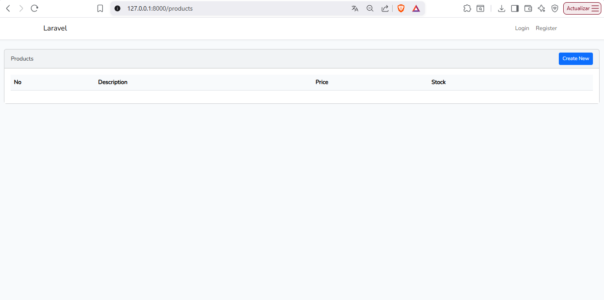
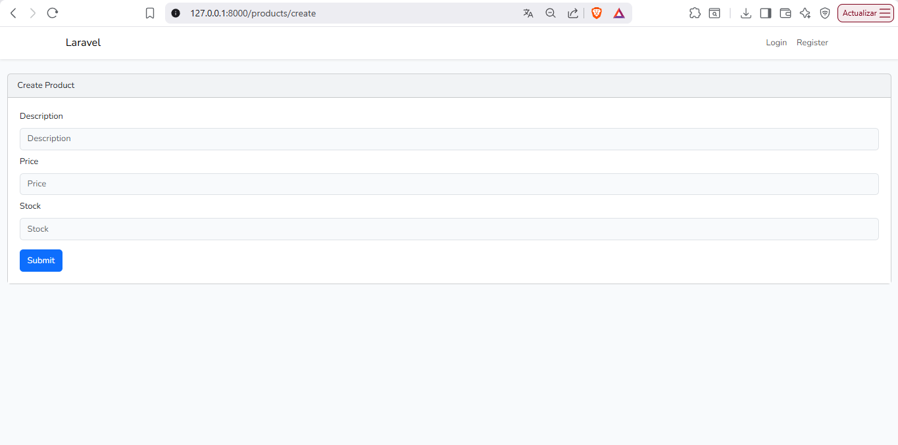
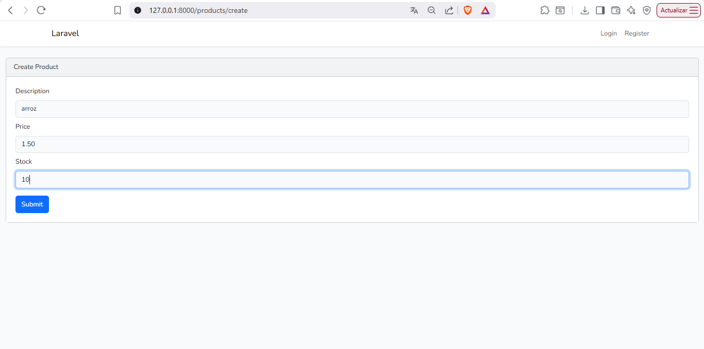
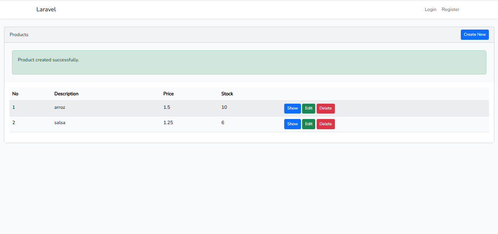
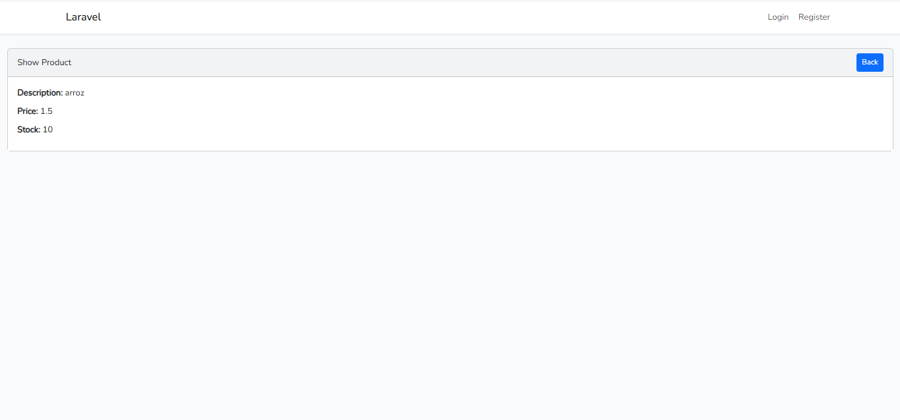
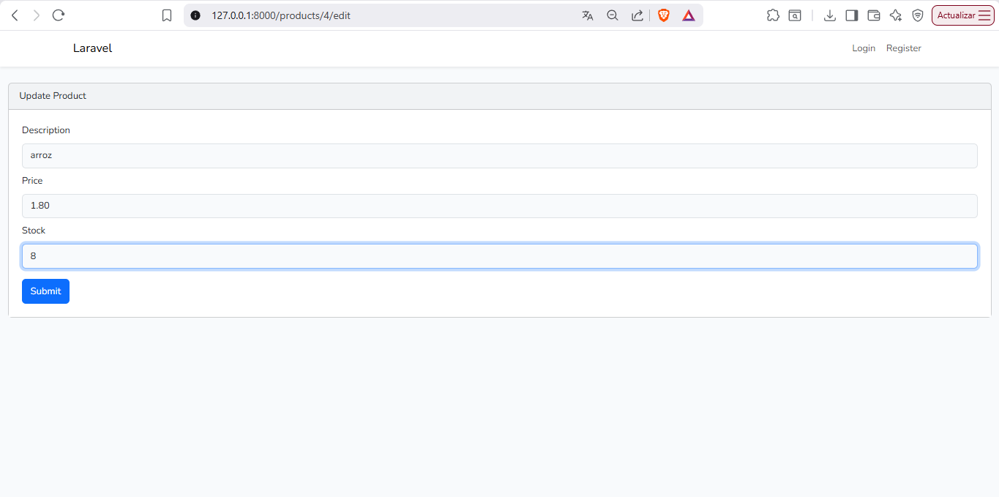
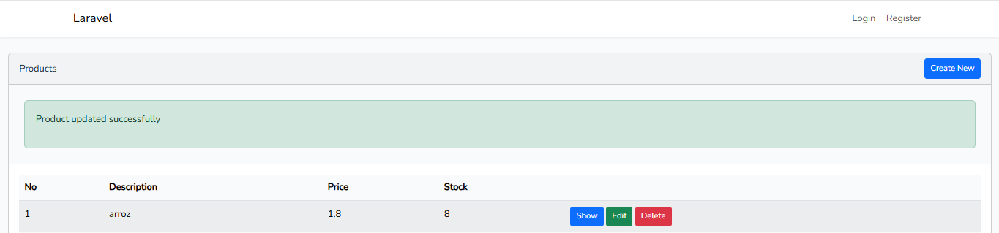
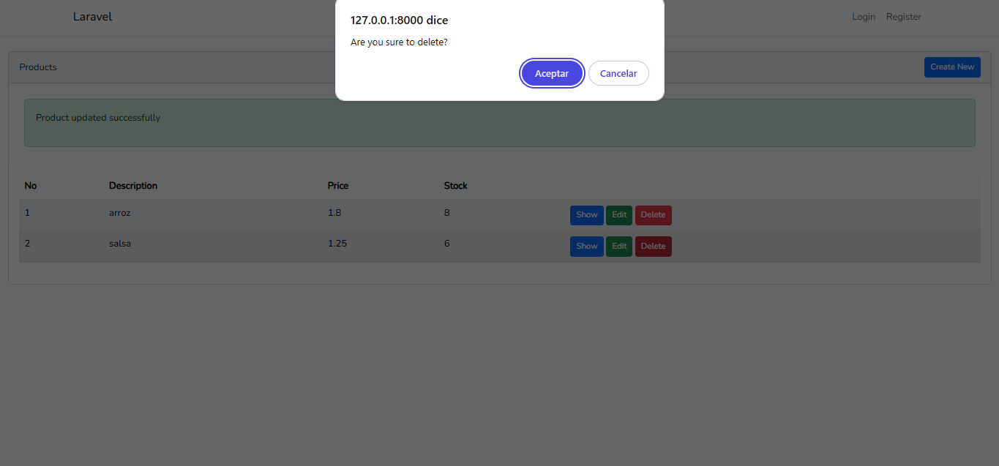
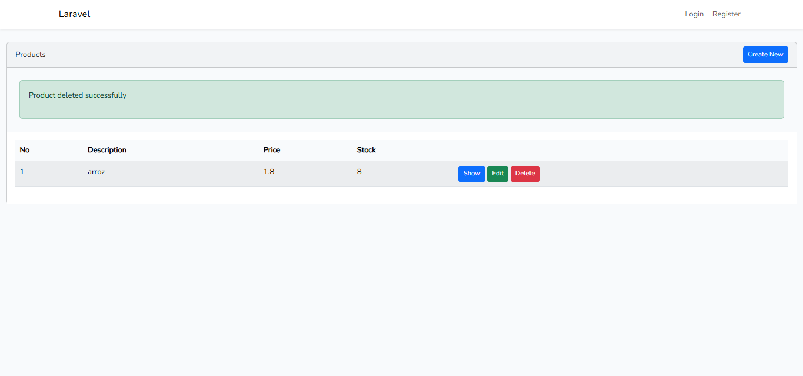

# 🚀 CRUD Rápido con Laravel


Proyecto de demostración de cómo crear un CRUD completo en Laravel de forma rápida utilizando el paquete `ibex/crud-generator` junto con autenticación Bootstrap.

---

## 📋 Tabla de Contenidos

- [Requisitos previos](#-requisitos-previos)
- [Paso 1 – Crear el proyecto Laravel](#-paso-1--crear-el-proyecto-laravel)
- [Paso 2 – Configurar la base de datos](#-paso-2--configurar-la-base-de-datos)
- [Paso 3 – Instalar el generador de CRUD](#-paso-3--instalar-el-generador-de-crud)
- [Paso 4 – Crear el modelo y la migración](#-paso-4--crear-el-modelo-y-la-migración)
- [Paso 5 – Generar el CRUD](#-paso-5--generar-el-crud)
- [Paso 6 – Instalar Bootstrap y autenticación](#-paso-6--instalar-bootstrap-y-autenticación)
- [Paso 7 – Compilar assets y migrar](#-paso-7--compilar-assets-y-migrar)
- [Comandos de mantenimiento](#-comandos-de-mantenimiento)
- [Errores comunes y soluciones](#-errores-comunes-y-soluciones)
- [Capturas de ejecución](#-capturas-de-ejecución)
- [Footer](#-información-académica)

---

## ✅ Requisitos previos

Antes de comenzar, asegúrate de tener instalado lo siguiente:

| Herramienta | Versión mínima |
|-------------|----------------|
| PHP | 8.2 o superior |
| Composer | 2.x |
| Node.js | 18.x o superior |
| npm | 9.x o superior |
| MySQL / MariaDB | 8.x / 10.x |
| Laravel Installer | Opcional |

---

## 📁 Paso 1 – Crear el proyecto Laravel

Abre tu terminal y ejecuta el siguiente comando para crear un nuevo proyecto Laravel llamado `crud_rapido`:

```bash
laravel new crud_rapido
```

Luego entra al directorio del proyecto:

```bash
cd crud_rapido
```

Inicia el servidor de desarrollo para verificar que todo funciona:

```bash
php artisan serve
```

> Accede a `http://127.0.0.1:8000` en tu navegador para confirmar la instalación.

---

## 🗄️ Paso 2 – Configurar la base de datos

Abre el archivo `.env` en la raíz del proyecto y ajusta las siguientes variables con tus credenciales de base de datos:

```env
DB_CONNECTION=mysql
DB_HOST=127.0.0.1
DB_PORT=3306
DB_DATABASE=crud_rapido
DB_USERNAME=root
DB_PASSWORD=tu_password
```

> Asegúrate de crear la base de datos `crud_rapido` en tu gestor de MySQL antes de continuar.

---

## 📦 Paso 3 – Instalar el generador de CRUD

Instala el paquete `ibex/crud-generator` como dependencia de desarrollo:

```bash
composer require ibex/crud-generator --dev
```

Luego publica los archivos de configuración y vistas del paquete:

```bash
php artisan vendor:publish --tag=crud
```

> Esto creará un archivo de configuración en `config/crud.php` y las plantillas de vistas del generador.

---

## 🧩 Paso 4 – Crear el modelo y la migración

Crea el modelo `Product` junto con su migración usando el flag `-m`:

```bash
php artisan make:model Product -m
```

Abre el archivo de migración generado en `database/migrations/` y define las columnas de la tabla:

```php
public function up(): void
{
    Schema::create('products', function (Blueprint $table) {
        $table->id();
        $table->string('name');
        $table->text('description')->nullable();
        $table->decimal('price', 8, 2);
        $table->integer('stock')->default(0);
        $table->timestamps();
    });
}
```

---

## ⚙️ Paso 5 – Generar el CRUD

Con el modelo y la migración listos, genera el CRUD completo con:

```bash
php artisan make:crud products
```

> Este comando generará automáticamente el controlador, las vistas (index, create, edit, show) y las rutas necesarias para el modelo `Product`.

Verifica que las rutas fueron registradas correctamente:

```bash
php artisan route:list
```

---

## 🎨 Paso 6 – Instalar Bootstrap y autenticación

Instala el paquete `laravel/ui` para habilitar los scaffolding de frontend:

```bash
composer require laravel/ui --dev
```

Genera los archivos de Bootstrap:

```bash
php artisan ui bootstrap
```

Genera el sistema de autenticación completo (login, registro, dashboard) con Bootstrap:

```bash
php artisan ui bootstrap --auth
```

---

## 🔨 Paso 7 – Compilar assets y migrar

Instala las dependencias de Node.js:

```bash
npm install
```

Compila los assets de CSS y JavaScript para producción:

```bash
npm run build
```

> Para desarrollo con recarga automática puedes usar `npm run dev` en su lugar.

Ejecuta las migraciones para crear las tablas en la base de datos:

```bash
php artisan migrate
```

Finalmente, levanta el servidor:

```bash
php artisan serve
```

---

## 🛠️ Comandos de mantenimiento

Estos comandos son esenciales para mantener el proyecto funcionando correctamente, especialmente luego de hacer cambios en la configuración:

```bash
# Limpiar la caché de configuración
php artisan config:clear

# Limpiar la caché de la aplicación
php artisan cache:clear

# Limpiar la caché de rutas
php artisan route:clear

# Limpiar la caché de vistas compiladas
php artisan view:clear

# Regenerar el caché de configuración optimizado
php artisan config:cache

# Regenerar el caché de rutas
php artisan route:cache

# Ejecutar todas las migraciones pendientes
php artisan migrate

# Revertir y re-ejecutar todas las migraciones (⚠️ borra todos los datos)
php artisan migrate:fresh

# Revertir y re-ejecutar con seeders incluidos
php artisan migrate:fresh --seed

# Ver el estado actual de las migraciones
php artisan migrate:status
```

> 💡 **Tip:** Luego de cualquier cambio en `.env`, ejecuta `php artisan config:clear` y `php artisan config:cache` para que Laravel tome los nuevos valores.

---

## ❌ Errores comunes y soluciones

### 1. `Class "App\Models\Product" not found`
**Causa:** Composer no ha registrado el nuevo modelo.  
**Solución:**
```bash
composer dump-autoload
```

---

### 2. `SQLSTATE[HY000] [2002] Connection refused`
**Causa:** Las credenciales de la base de datos en `.env` son incorrectas o el servidor MySQL no está corriendo.  
**Solución:** Verifica que MySQL esté activo y que `DB_HOST`, `DB_PORT`, `DB_USERNAME`, `DB_PASSWORD` y `DB_DATABASE` estén correctamente configurados en `.env`. Luego ejecuta:
```bash
php artisan config:clear
php artisan config:cache
```

---

### 3. `Target class [CrudController] does not exist`
**Causa:** Las rutas generadas por el CRUD no encuentran el controlador.  
**Solución:** Verifica que el controlador fue creado en `app/Http/Controllers/` y que el namespace es correcto. Si no existe, regenera el CRUD:
```bash
php artisan make:crud products
```

---

### 4. `npm run build` falla o no genera assets
**Causa:** Dependencias de Node no instaladas o versión incompatible.  
**Solución:**
```bash
npm install
npm run build
```
Si persiste, borra `node_modules` y reinstala:
```bash
rm -rf node_modules
npm install
npm run build
```

---

### 5. `View [products.index] not found`
**Causa:** Las vistas del CRUD no fueron generadas correctamente.  
**Solución:** Verifica que existan los archivos en `resources/views/products/`. Si no existen, ejecuta nuevamente:
```bash
php artisan make:crud products
```

---

### 6. `php artisan migrate` error: `Table already exists`
**Causa:** Ya existen tablas de una migración anterior.  
**Solución:** Si estás en desarrollo, puedes usar:
```bash
php artisan migrate:fresh
```
> ⚠️ Esto borrará todos los datos existentes.

---

### 7. Página en blanco o error 500 en producción
**Causa:** Falta de permisos en carpetas o caché corrupta.  
**Solución:**
```bash
php artisan config:clear
php artisan cache:clear
php artisan view:clear
chmod -R 775 storage bootstrap/cache
```

---

### 8. `TokenMismatchException` al hacer submit de formularios
**Causa:** La directiva `@csrf` no está incluida en los formularios.  
**Solución:** Asegúrate de incluir `@csrf` dentro de cada `<form>`:
```html
<form method="POST" action="/products">
    @csrf
    ...
</form>
```

---

## 📸 Capturas de ejecución

---









---

## 📚 Recursos útiles

- [Documentación oficial de Laravel](https://laravel.com/docs)
- [Paquete ibex/crud-generator](https://github.com/ibex/crud-generator)
- [Laravel UI](https://github.com/laravel/ui)
- [Bootstrap 5](https://getbootstrap.com/)

---

---

## 🎓 Información Académica

<div align="center">

| | |
|---|---|
| 🏛️ **Institución** | Universidad Tecnológica de Panamá |
| 📘 **Curso** | Desarrollo de Software VII |
| 👨‍💻 **Desarrollado por** | Erick Hou — 8-1017-473 |
| 👩‍🏫 **Facilitador** | Irina Fong |

</div>

---

<div align="center">

*Universidad Tecnológica de Panamá — Facultad de Ingeniería de Sistemas Computacionales*

</div>
